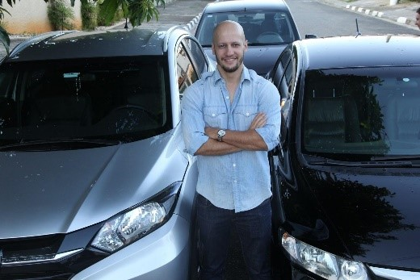
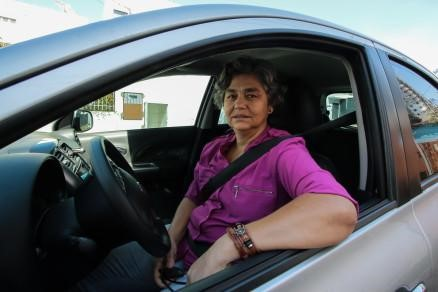
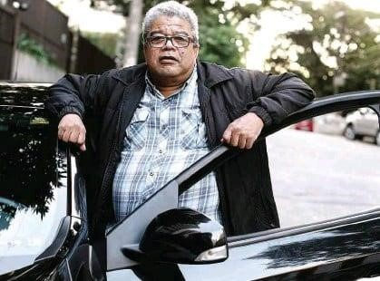

# Especificações do Projeto

Pré-requisitos: <a href="1-Documentação de Contexto.md"> Documentação de Contexto</a>

A definição exata do problema e os pontos mais relevantes a serem tratados neste projeto foram consolidados a partir de pesquisas de mercado e entrevistas feitas com motoristas profissionais atuantes no transporte por aplicativo. Os detalhes levantados nesse processo foram consolidados na forma de personas e histórias de usuários.

## Personas

### **`Rodrigo Monteiro`**

|   | **Rodrigo Monteiro**   47 anos   |
|:---------------------------------------:|:-------------------------------:|
|**Ocupação** | Advogado 
|**Principais Aplicativos Utilizados** |Instagram, Facebook, Internet Banking, Uber, 99 Pop e Waze
|**Motivação** |Familia, Rentabilidade, Liberdade
|**Frustrações** |Burocracias, Desvalorização do trabalho, Custo Brasil|
|**Hobbies/Histórias** |Jogar Futebol, Churrascos, Proprietário de Frota|
 
  
### **`Sônia Maria`**

|   | **Sônia Maria**   56 anos   |
|:---------------------------------------:|:-------------------------------:|
|**Ocupação** | Contadora 
|**Principais Aplicativos Utilizados** |Instagram, IQ Option, Whatsapp, Canvas, Waze e Hotel Hurbano
|**Motivação** |Familia, Saúde
|**Frustrações** |Desrespeito, Falta de Profissionalismo|
|**Hobbies/Histórias** |Viajar, Yoga, Cuidar dos Netos|
 
  

### **`Felipe Almeida`**

|   | **Felipe Almeida**   24 anos   |
|:---------------------------------------:|:-------------------------------:|
|**Ocupação** | Frentista 
|**Principais Aplicativos Utilizados** |Instagram, Facebook, Whatsapp, Uber, Waze e Telegram
|**Motivação** |Estudar e Dirigir
|**Frustrações** |Dificuldade de gerir o tempo, Insegurança|
|**Hobbies/Histórias** |Correr, Bar e encontros, Jogos Online, Viajar|

### **`João Hélvecio`**

|   | **João Hélvecio**   63 anos   |
|:---------------------------------------:|:-------------------------------:|
|**Ocupação** | Aposentado 
|**Principais Aplicativos Utilizados** |Whatsapp, Uber, Waze e Radio Itatiaia
|**Motivação** |Estabilidade, Educação dos netos, Dirigir
|**Frustrações** |Acompanhar a Tecnologia, Usabilidade dos Aplicativos|
|**Hobbies/Histórias** |Teatro, Dançar, Caminhar, Netos|

## Histórias de Usuários

Com base na análise das personas forma identificadas as seguintes histórias de usuários:

|EU COMO... `PERSONA`| QUERO/PRECISO ... `FUNCIONALIDADE` |PARA ... `MOTIVO/VALOR`                 |
|--------------------|------------------------------------|----------------------------------------|
|Rodrigo e Sônia	|Anunciar veículo para locação.	|Precisa anunciar seus veículos para locação.|
|Rodrigo |	Encontrar motoristas que se encaixem no perfil desejado.	|Encontrar motoristas que se encaixem no perfil desejado.|
|Rodrigo e Sônia|	Realizar o contato com o locatário e validar informações.|	Precisa fazer contato para concluir o negócio (locação).|
|Sônia e João Hélvecio|	Navegar com facilidade no site.	|Conseguir intuir bem os comandos, pois usualmente encontra dificuldade em sites que possuem muita informação.|
|Felipe|	Obter informações detalhadas sobre a oferta dos veículos para locação parcial.|	Precisa definir as melhores opções para locar o veículo para trabalhar conciliando outra atividade.|
|Felipe|	Formalizar interesse na locação e obter resposta de forma rápida.	|Precisa fazer contato para iniciar a negociação e gostaria de ter uma resposta ágil.|
|Felipe e João Hélvecio|	Procurar por veículos para rodar em período comercial, durante a semana.|	Não tem veículo e precisa alugar um para trabalhar como motorista de aplicativo no horário comercial.|
|Sônia|	Obter segurança no envio e armazenamento dos dados|	Sente insegurança em fornecer alguns tipos de informações pessoais, por medo de fraude.|
|Felipe|	Ser avisado de novas ofertas de aluguel pelo período desejado|	Gostaria de adiantar-se, quando novas ofertas com seu perfil forem anunciadas no site.|
|João Hévecio|	Gostaria de ter muitas possibilidades, escolher o modelo de carro que quiser.|	Encontrar a melhor opção, pois possui modelos e marcas de preferência, que o site não seja restrito|

## Requisitos

O escopo funcional do projeto é definido por meio dos requisitos funcionais que descrevem as possibilidades interação dos usuários, bem como os requisitos não funcionais que descrevem os aspectos que o sistema deverá apresentar de maneira geral. Estes requisitos são apresentados a seguir.

### Requisitos Funcionais

A tabela a seguir apresenta os requisitos do projeto, identificando a prioridade em que os mesmos devem ser entregues.

|ID    | Descrição do Requisito  | Prioridade |
|------|-----------------------------------------|----|
|RF-01|	Deve possuir tela de home com possibilidade de busca dos veiculos disponiveis;|	ALTA|
|RF-02|	Disponibilizar as ofertas de aluguel de veículos;|	MÉDIA|
|RF-03|	Solicitar e disponibilizar aos usuários informações basicas e a partir disso realizar a elaboração de perfis e anúncio;	|ALTA|
|RF-04|	Deve possuir cadastro de clientes, para anunciantes e interessados na locação de veículos;|	ALTA|
|RF-05|	Deve possuir caixa de mensagens com a opção de enviar msg direta ao locador;	|BAIXA|
|RF-06|	Entregar o maior número de anuncios/ofertas de acordo com as informações requeridas;	|MÉDIA|
|RF-07| O site deve possuir um sistema de "match", para que o locatário marque de forma instantânea interesse na opção de locação desejada e para que o locador consiga formalizar o aluguel da forma mais breve possível;	|BAIXA|
|RF-08|	Feito a busca das ofertas disponíveis, o usuário pode criar uma alerta para o período desejado, a fim de saber atualizações de novas disponibilidades de veículos;	|BAIXA|

### Requisitos não Funcionais

A tabela a seguir apresenta os requisitos não funcionais que o projeto deverá atender.

|ID     | Descrição do Requisito  |Prioridade |
|-------|-------------------------|----|
|RNF-01|	O site deve ser publicado em um ambiente acessível publicamente na Internet (Repl.it, GitHub Pages, Heroku);|	ALTA|
|RNF-02|	O site deverá ser responsivo permitindo a visualização em um celular de forma adequada	|ALTA|
|RNF-03|	O site deve ter bom nível de contraste entre os elementos da tela em conformidade	|MÉDIA|
|RNF-04|	O site deve ser compatível com os principais navegadores do mercado (Google Chrome, Firefox, Microsoft Edge)	|ALTA|

## Restrições

As questões que limitam a execução desse projeto e que se configuram como obrigações claras para o desenvolvimento do projeto em questão são apresentadas na tabela a seguir.

|ID| Restrição                                             |
|--|-------------------------------------------------------|
|RE-01|	O projeto deverá ser entregue no final do semestre letivo, não podendo extrapolar a data de 26/06/2022|
|RE-02|	O aplicativo deve se restringir às tecnologias básicas da Web no Front-end|
|RE-03|	O site não deve permitir a locação para outros fins além de transporte por aplicativos|
+