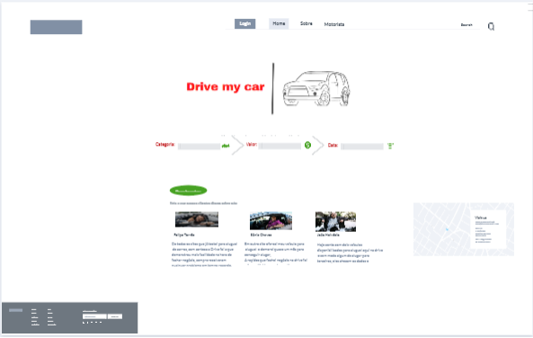

## Projeto de Interface
Pré-requisitos: Documentação de Especificação

Visão geral da interação do usuário pelas telas do sistema e protótipo utilizando termos e conceitos que tenham como base a experiência das pessoas que mais vão utilizar o sistema. (wireframes).

## User Flow

O Fluxo de usuário (User Flow) para mapear todas as telas do site e traçar os possíveis caminhos de ações de fornecedor final (Dono de veiculos), cliente final (Motorista Locador) e Drive My Car (Intermediador locatário), dentro do site formam o diagrama abaixo que é apresentado na Figura 1. 

A imagem abaixo também pode ser consultada através do link: https://lucid.app/lucidchart/3ff07d41-6d8e-407a-b6db-b100ce4633da/view?page=0_0&invitationId=inv_6054800d-76fa-444c-a361-1cd64dd9282e# onde é possível ampliar para visualizar melhor o fluxo. A tela sera, apresentada posteriormente em detalhes.

##### Figura 1: Fluxo de usuário para a pagina DriveMyCar

## Wireframes

![telahome]   

