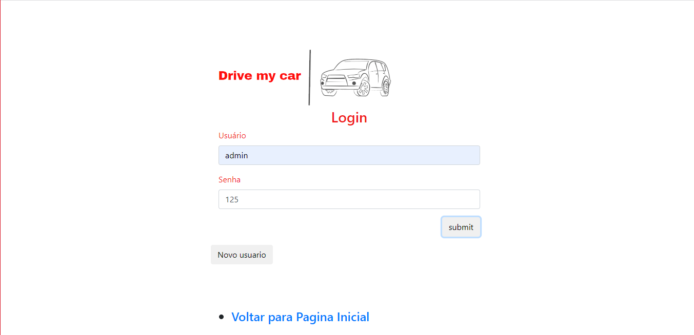

# Registro de Testes de Software

- Teste 01:
Testar acesso a página de login e sua funcionalidade: 

 

- Teste 02: 
Testar acesso a página de cadastro e sua fucionalidade:

  
  

- Teste 03: 
Testar página frota contendo todos os carros disponíveis com imagem e informações específicas de cada veículo:

 

- Teste 04: 
Testar  as opções disponíveis de categorias: Standard, Intermediária, Premium:

 

- Teste 05: 
Testar cadastro específico para envio e verificação de documentação: 

  
 

- Teste 06: 
Testar página de pagamento e  cadastro das informações financeiras como cartão de débito, crédito e opção de mercado pago:

 

- Teste 07: 
Testar página de histórico das solicitações ja realizadas pelos clientes:

 

- Teste 08: 
Testar calculadora conforme valores e diárias:

 

Pré-requisitos: <a href="3-Projeto de Interface.md"> Projeto de Interface</a>, <a href="8-Plano de Testes de Software.md"> Plano de Testes de Software</a>

Relatório com as evidências dos testes de software realizados no sistema pela equipe, baseado em um plano de testes pré-definido.

## Avaliação

Discorra sobre os resultados do teste. Ressaltando pontos fortes e fracos identificados na solução. Comente como o grupo pretende atacar esses pontos nas próximas iterações. Apresente as falhas detectadas e as melhorias geradas a partir dos resultados obtidos nos testes.

> **Links Úteis**:
> - [Ferramentas de Test para Java Script](https://geekflare.com/javascript-unit-testing/)